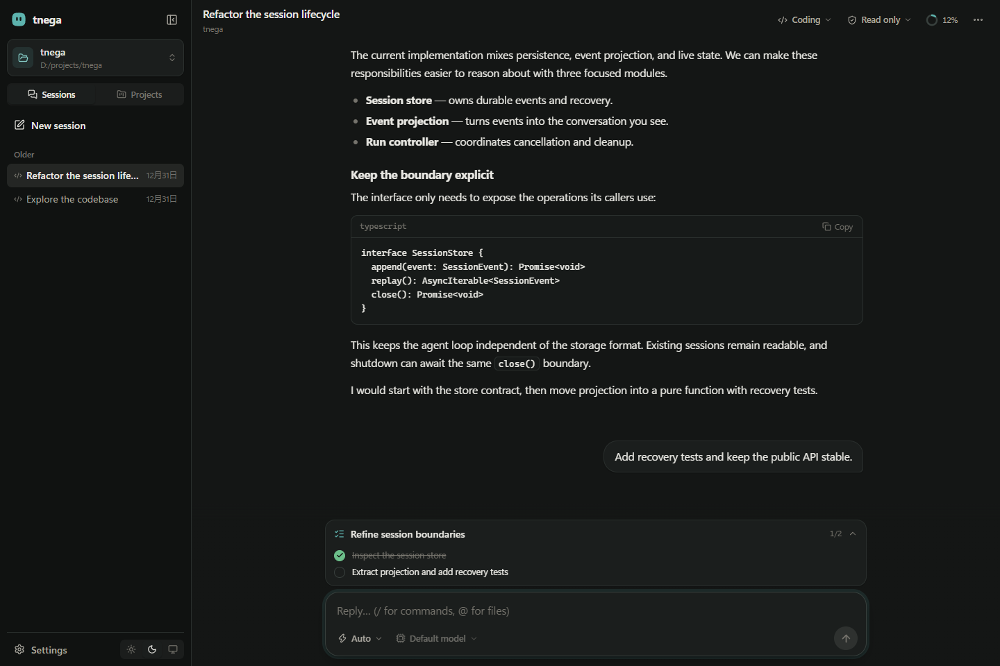

<p align="center">
  
</p>

# Tnega

[中文](docs/zh-CN.md)

**Tnega** is "agent" spelled backwards. It is an eval-first agent harness with spacetime-composable plugin lifecycles: components can be hot-swapped and rolled back safely, and Eval is a first-class citizen on par with the agent loop and tools.

Use it for coding, document work, or ongoing projects with a coordinator and parallel agents—all in a local Web or desktop interface.



*Current Web interface, shown with isolated demo data.*

## Features

- **Projects:** keep an ongoing conversation with a coordinator that delegates work to parallel Threads. Follow their progress, reply directly, and bring shared Memory and a Library of files and artifacts into the same project. [Project guide](docs/project/README.md).
- **Work agent:** create, inspect and edit Word documents, Excel workbooks and PowerPoint presentations with built-in Office tools, alongside General and Coding agents.
- **Automatic artifact discovery and previews:** successful Office create/edit calls produce file cards in the conversation, including calls inside CodeMode. Click a card to preview DOCX pages, XLSX sheets and charts, or PPTX slides beside the conversation, with zoom and download controls.
- **Composable agent runtime:** scoped services, reversible plugin lifecycles, tools, LLM adapters, and evaluation share the same core.
- **Durable conversations:** General, Coding and Work sessions use JSONL event logs; the UI supports session forks, context compaction, provider usage and cache metrics, and a readable activity timeline.
- **Coding workflows:** Auto runs tools, Plan produces a plan, and Goal advances a persistent objective. Coding sessions also support slash commands, workspace skills, and configured MCP servers.
- **Subagents:** agents can spawn or fork child sessions, communicate through durable inboxes, and inspect child progress. The UI shows child tasks and renders their conversations.
- **Memory:** `~/.tnega/MEMORY.md` stores explicitly requested preferences; each workspace's `.tnega/MEMORY.md` records durable project conventions during compaction.
- **Model selection:** configure multiple model routes, credentials, protocols, and supported thinking levels in System Config. The composer offers model and thinking sliders for each session.
- **Tool permissions:** choose read-only, workspace-write, or bypass per run. Higher-permission actions request approval when required; workspace search uses ripgrep and public web search is available in read-only mode.
- **CodeMode / PTC:** opt into CodeMode in Settings to expose only `run_code`; JavaScript orchestrates existing tools in QuickJS with their original permission checks. Disable it to use native tools. See [design and tradeoffs](docs/adr/0010-ptc-tool-orchestration.md).
- **Automatic approval:** independently choose Ask me or Auto review. A scoped plugin reviews each gated action with the conversation model, a configured model route, TypeSafe Jev, or OpenAI Responses. Missing credentials, uncertainty, cancellation and oversized evidence fall back to human approval; sandbox policy still applies. See [configuration](packages/auto-approval/README.md).
- **Run summaries:** an independent plugin persists the final successful reply; completed runs show that reply and collapse intermediate work into an expandable process. Failed or cancelled runs remain visible. This does not call another model or compact model history.
- **Sandbox:** shell execution is wrapped by a local sandbox backend (bubblewrap or Landlock on Linux, Seatbelt on macOS, a restricted-token ACL runner on Windows). It is a capability seam with a functional probe and fail-closed semantics: when no backend is usable the command is refused rather than run unconfined.
- **Local Web and desktop UI:** the Electron app hosts the same loopback-backed interface, with an in-app Settings dialog. Eval and Evolve remain available from the CLI and library.

## Install

Requires Node.js >= 22.

```bash
npm install -g tnega
# or
pnpm add -g tnega
```

## Quick Start

```bash
export TNEGA_API_KEY=sk-...
tnega run "Reply with: hello"
```

`tnega run` uses OpenCode Go's `deepseek-v4-flash` model through the OpenAI compatible endpoint by default. `minimax-m3` is also available through the Anthropic Messages endpoint. Set `TNEGA_API_KEY` for the API key; `OPENCODE_GO_API_KEY`, `OPENAI_API_KEY`, and `DEEPSEEK_API_KEY` remain compatible fallbacks. System Config lives at `%USERPROFILE%\.tnega\config.json` on Windows or `~/.config/tnega/config.json` on Linux/macOS. It accepts the original `apiKey`, `model`, `baseUrl`, `protocol`, and `temperature` fields, plus a `models` array with per-model routes and `reasoningEfforts`. See the [multi-model configuration example](packages/cli/README.md#系统配置configts). CLI flags and environment variables override the legacy defaults; a selected model's explicit route and credential are used for that session.

Run a deterministic eval without an API key:

```bash
tnega eval run examples/tasks.yml
```

Start the local web UI:

```bash
tnega web
# http://127.0.0.1:3080
```

The web UI creates `general`, `coding`, or `work` sessions. Coding sessions offer Auto,
Plan, and Goal modes: Plan produces a plan without executing it, and Goal tracks
a persistent objective. `/` slash commands such as `/mode`, `/skills`, and
`/mcp` are available in coding sessions.

Switch the sidebar to **Projects** to create a named project and start a conversation
with its coordinator. Open a Thread to inspect its conversation or leave a direct
message; use the project panel for Overview, Memory, Library and Settings.

For document work, choose **Work** and describe the document, spreadsheet or slide
deck you need. Generated Office files appear as cards below the agent's activity;
click a card to preview or download it.

## CLI

```text
tnega run "prompt"                       # one agent session
tnega run --allow-shell "list files"     # enable high-permission tools
tnega web                                # local web UI
tnega eval run tasks.yml                 # run evals
tnega eval compare <base> <head>         # compare two eval runs
tnega evolve run tasks.yml               # run a self-evolution loop
```

Options include `--model`, `--base-url`, `--max-tokens`, `--temperature`, `--cwd`, `--session`, `--timeout-ms`, `--max-retries`, and `--retry-delay-ms`. Sessions are recorded as JSONL under `.tnega/`.

## Built-in Tools

The default tool set is `echo`, `now`, `calculator`, `json`, `read_file`, `write_file`, `list_dir`, `glob`, and `grep`. High-permission tools are opt-in: `http_get` requires `--allow-network`, `shell` requires `--allow-shell`. File tools are confined to the working directory, and shell commands are wrapped by the sandbox seam.

`sandbox`, `sandbox-local`, and `execution-sandbox` form the sandbox capability seam: `@tnega/sandbox` owns the `ctx.sandbox` contract, `@tnega/sandbox-local` provides the local backends, and `@tnega/execution-sandbox` is the model-facing consumer that wraps the execution boundary the `shell` tool uses. Providers are chosen in the composition layer, so swapping a backend is a mounting change. Selection is a **functional probe** per platform chain (`bwrap` → `landlock` on Linux, `sandbox-exec` on macOS, the ACL restricted-token runner on Windows), and an unusable chain fails closed with `SANDBOX_UNAVAILABLE` instead of running the command unconfined. Only file writes are restricted; `read-only` denies every write and `workspace-write` allows the workspace plus a temp root. `@tnega/fs-sandbox` holds the single path-containment implementation behind `read_file` / `write_file` / `list_dir` / `glob` / `grep` / shell. See `docs/adr/0008-sandbox-seam.md`.

`glob` and `grep` are the model-facing consumers of the workspace search capability seam: `@tnega/search` owns the `ctx.search` contract, `@tnega/search-ripgrep` provides it, and `@tnega/tool-search` contributes the tools. The tools only ever see `ctx.search`, so swapping the provider is a composition change. Traversal delegates to ripgrep: the provider builds a plain argv vector and spawns `rg` with no shell layer, so `.gitignore` handling, hidden files, and ignore rules are ripgrep's native behavior. It honors the workspace `.gitignore` by default (with `--no-require-git`, so this also applies outside a git repository) and always prunes `.git`, `node_modules`, and similar directories. `rg` must be on `PATH`, or be named by the provider's `ripgrepPath` option. See `docs/adr/0006-capability-seams.md`.

## Coding Agent

`tnega/coding-agent` is a packaged agent plugin for workspace-oriented coding
sessions. It contributes plan generation, `plan_execute_mark` /
`plan_execute_result` tools, workspace skills (`skills_list` / `skill_read`),
stdio MCP servers from `.tnega/mcp.json`, and a slash command registry. The web
server enables it per session through `agentType: "coding"`, while general
sessions keep the default loop unchanged.

## Desktop client

The Electron client packages the same local console as a native desktop app. It
starts the Tnega server on an ephemeral loopback address and never exposes Node,
Shell, or filesystem access directly to the renderer. Folder selection is a
small, validated native bridge; every Tool Permission remains an explicit choice
for each Agent Run.

```bash
pnpm --filter @tnega/desktop dev       # build and launch locally
pnpm package:desktop                   # produce the Windows installer
```

Download the Windows installer from [GitHub Releases](https://github.com/whale4rain/tnega/releases).

The desktop app and `tnega web` share System Config and Workspace/Session data.
See [`apps/desktop/README.md`](apps/desktop/README.md) for packaging targets and
the security model. Contributors should read
[`apps/desktop/AGENTS.md`](apps/desktop/AGENTS.md) before changing the desktop
client.

## Library

Tnega is published as a library as well as a CLI. Use the root package or domain subpaths (`tnega/core`, `tnega/agent`, `tnega/coding-agent`, `tnega/eval`, `tnega/evolve`, `tnega/session`, `tnega/tools`, `tnega/llm`, ...):

```ts
import { Context, defineAgent, openaiCompatAdapter } from 'tnega'

const root = new Context()
const fiber = await root.plugin(
  defineAgent({
    name: 'coding-agent',
    version: '0.3.0',
    system: 'You are a coding agent.',
  }),
  { llm: openaiCompatAdapter({ apiKey: process.env.TNEGA_API_KEY! }) },
)

const loop = root.get('agentLoop')
const result = await loop({ text: 'implement the feature' })
console.log(result.output)

await fiber.dispose()
```

## Concepts

- **Spacetime composability**: components can be inserted, replaced, and removed at runtime; effects are reversed in order on teardown, so hot-swaps leave no residue.
- **Eval as infrastructure**: strategies, tasks, evidence, verdicts, and runs are pluggable primitives, and evaluation is also the fitness function for self-evolution.
- **Self-evolution**: `evolve` proposes candidates, evaluates them in isolated scopes, and accepts or rejects them through deterministic gates.

See the [Chinese guide](docs/zh-CN.md) for the detailed design, model pricing table, library contracts, and roadmap.

## Development

```bash
pnpm install
pnpm test
pnpm typecheck
pnpm lint
pnpm build
```

## License

MIT
