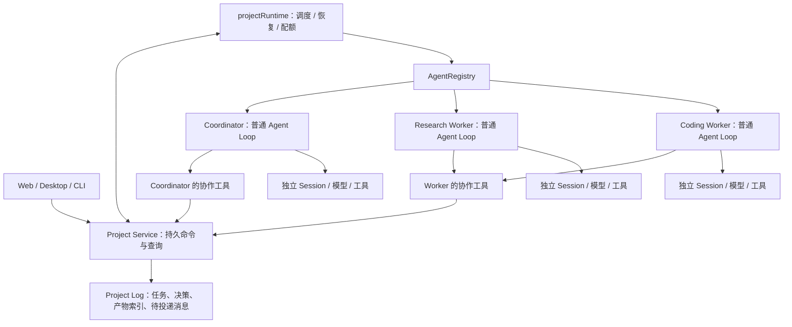

# Project 协作运行时设计草案

> 状态：进行中
> 取代关系：无；承接 [多智能体方向调研](../../research/2026-09-24-multi-agent-products.md)
> 当前实现：代码基线 `786850e`；本稿为提案，新增类型与插件尚未实现。当前事实见 [Agent](../../../packages/agent/README.md)、[Subagent](../../../packages/subagent/README.md) 和 [Session](../../../packages/session/README.md)。

日期：2026-09-24。目标是实现方向 A：用户通过一个 Project 主会话交付工作，协调 Agent 委派独立 Thread，用户可查看、纠正和验收。下期再根据专业 worker 的使用记录演化能力配置。本稿明确模块职责与协议边界；逐文件编码任务在设计收敛后拆分。

## 推荐架构

新增高于 Agent Loop 的 `projectRuntime` 插件，负责调度、恢复以及多个执行者的生命周期。Coordinator 与 Worker 都使用现有 Agent Loop，通过各自的工具访问 Project Service。

Coordinator 决定做什么、如何分工和如何处理结果。Runtime 检查依赖与并发配额，校验权限，并执行状态转移和消息投递。模型的输出不能直接充当调度事实。

不替换普通 Agent Loop：项目暂停、浏览器断连和 worker 故障都可能发生在模型调用之外，需要由长期存活的运行时处理。Loop 插件仍适合以后针对某一种 worker 调整单次执行算法。



Project 的主会话是一个 `kind: coordinator` 的 Thread。Project Runtime 拥有全部 Agent handle，协调者与 worker 的 Fiber 是同级运行单元；业务上的委派关系独立保存。协调者结束一轮、压缩上下文或更换 Session，都不会自动销毁 worker。

Project 创建的 Agent 一律使用 `manualStreaming: true`。只有 Runtime 在取得执行配额后驱动 `runTurns()`；HTTP handler 和工具投递消息都不直接启动 Loop。这样恢复 inbox 或连续收到消息也不能绕过并发上限。结束或暂停必须等到驱动器和工具达到静止状态后才释放执行配额。

## 领域对象与身份

以下是待采纳的术语，暂不写入当前 `CONTEXT.md`。

| 对象 | 含义与归属 | 生命周期 |
| --- | --- | --- |
| Project | 协作容器，拥有 Thread，以及共享决策和产物目录 | 多次用户交互持续存在 |
| Thread | 有独立目标、上下文和进度的一项工作；主会话也使用此抽象 | 可经历补充要求、返工和多次执行 |
| Execution | Thread 在一个固定 profile 与环境配置下的一段执行历史；字段使用 `executionId` | 包含一个 Session 及多次 Agent Run |
| Session | 该执行者的模型交互日志，仍是消息历史真源 | 延续现有 JSONL 语义 |
| LiveAgent | Execution 当前加载到进程内的执行对象 | 可以卸载和重新恢复 |
| WorkerProfile | 某类执行者的版本化能力配置 | 可被多个 Thread 的 Execution 复用 |
| Decision | 有依据和适用范围的决定，归 Project 索引 | 可以提议、采纳或被后续决定替代 |
| ArtifactRevision | 一份不可变产物版本，记录生产者与来源 | 随 Project 保留，独立于 Agent 是否存活 |

关系为 `Project → Thread → Execution → Session → Agent Run`。一个 Thread 同时最多有一个未结束的 Execution；一次 Execution 的 Session 最多一个 active Agent Run。复查工作通过另一个 Thread 执行，避免把两个 active Agent 塞进同一条历史。

使用 `Execution`，避免与已有 assistant stream 的临时 `attemptId` 混淆。恢复同一个执行者使用同一 Session；任务改派、profile 版本变化或需要干净上下文时，新建 Execution 和 Session，旧记录保留。新 Session 获得明确交接材料，不自动复制父会话全部历史。

Thread 的 `createdByThreadId` 记录来源；`dependsOn` 单独表达依赖，形成项目内 DAG。父子关系无法表达多个任务共同依赖一份结果，所以不能用一棵树代替依赖图。删除或取消上游不级联删除日志；下游进入依赖阻塞，等待改依赖或取消。

第一期一个 Project 绑定一个源 Workspace，coding worker 可以有派生的隔离 Workspace。多个 Project 可以引用同一源目录；写入和集成互斥必须按真实 Workspace 标识控制。跨仓库 Project 留给后续版本。

现有 Agent Run 术语限定“由用户消息触发”，实现本稿时需扩展为“由一次已接纳输入触发”，包括用户消息与可追溯的委派/恢复输入。一个 Agent Run 仍只属于一个 Session。已有 Session 内 Goal 保留；Project 目标不直接改成某个 Session 的 Goal。

## 状态管理

三个层面的状态分别记录，UI 可以组合显示。

| 层面 | 建议状态 | 事实来源 |
| --- | --- | --- |
| Thread 工作状态 | `open / blocked / awaiting_review / completed / cancelled` | Project Log |
| Execution 执行状态 | `queued / active / suspended / ended`；结束带 outcome | Project Log 与 Session 结束记录核对 |
| LiveAgent | 保留现有 `idle / running`；未加载以 handle 不存在表达 | 当前进程 |

Execution outcome 使用 `submitted / failed / interrupted / cancelled / superseded`。Thread 的 `blocked` 携带 `dependency / approval / user_input / budget / recovery / integration` 等原因和关联对象；暂停项目另用 Project 的 `active / paused / archived` 状态表达，不给每个 Thread 增加一套暂停状态。

典型流程：

```text
Thread open
  → Execution queued → active
  → worker 提交结果
  → Execution ended(submitted)，Thread awaiting_review
  → 验收通过：Thread completed
  → 需要返工：Thread open，新建 Execution

Thread open → blocked(reason) → 条件满足 → open
Thread 非终态 → cancelled
```

`idle` 只表示模型当前没运行。完成一次模型回复不会自动完成 Thread；worker 必须通过 `thread_submit` 声明产物和完成依据，验收者再作决定。

主会话 Thread 常驻 open，coordinator Execution 空闲时不占模型执行配额；项目归档才结束它。worker 若以普通回复结束却没有提交或说明阻塞，Runtime 只允许一次有预算的格式补充；仍无有效结果则结束为 failed，并把 Thread 置为 blocked(user_input)。不能无限保持“执行中”。

状态改变由命令处理器校验当前 revision 与调用者身份，再检查动作是否被当前状态允许，以及关联产物是否存在。模型不能直接提交任意 `status` 字段。已完成任务如需继续，用显式 reopen 命令提升任务 revision；原验收及其引用版本继续保留。

任务目标或关键 Decision 改变后，提高 `taskRevision`。所有提交绑定创建时的 taskRevision 与 executionId；旧 Execution 的迟到结果保存为历史，不能覆盖新状态。运行中的改向要通过持久消息送到最近的安全边界；重大变更先停旧 Execution，再创建新的执行记录。

## 插件和包如何组织

沿用仓库的 Service Definition / Provider / Consumer 规则，把相关包放在 `packages/project/` 下。下列路径均为拟新增。

| 包 | 公开职责 | 依赖规则 |
| --- | --- | --- |
| `project` | 抽象 `ProjectService`（`ctx.projects`）、命令/事件类型、状态归约及公共校验 | 依赖 core；不依赖具体存储、Agent Loop 或 CLI |
| `project-local` | 本地 Project Log、文件产物存储、串行命令提交与快照查询 | 只通过 project 的契约实现服务；不注册模型工具 |
| `project-runtime` | 调度器、Execution 生命周期、投递与恢复；profile 装配接口 | 依赖 project Definition 和 agent 等底层契约；不 import project-local |
| `tool-project` | 按角色提供协作工具和受约束的命令入口 | 依赖 project Definition 与 tools；不选择 Provider |
| CLI/Web 的组合层 | 选择本地 Provider，解析配置，装配 profile 和运行环境 | 可以依赖具体实现；Web 与 Eval 复用同一启动入口 |

`project-runtime` 作为 project 能力的程序化 Consumer，和 `tool-project` 一样通过契约工作。项目文件操作与内容存储留在 local Provider。Git 环境准备先作为 runtime 内部的依赖注入模块，通过现有 execution 库执行；第二种真实运行后端出现后再提取独立能力缝。

每个 Project 使用独立 Context，分别挂载一个 project-local 和一个 project-runtime，避免同作用域重复服务。宿主维护 ProjectHost 索引并管理这些 Context；项目间不共享可写 Agent registry 或工具注册表。模型凭据解析器等无状态依赖可以由宿主注入。Runtime 必需服务列入 inject，所有监听与进程清理均归其 Fiber。

ProjectService 提供三个小入口：

- `command(command, actor)`：接收带 commandId 和 expectedRevision 的判别联合命令；提交后返回 revision 与结果引用。
- `query(query, actor)`：读取一致快照或带游标的记录。UI 与工具复用相同投影。
- `watch({ afterRevision }, actor)`：读取提交后的项目变更，可断线追赶。

查询游标使用全局 Project revision；写入冲突检查主要针对被修改的 Thread/Decision revision，避免两个无关 worker 提交时互相冲突。跨对象命令在同一条 Project 提交中校验全部前置条件。冲突返回最新 revision，由调用者重新读取；不以最后写入获胜。

Thread 创建/修改和消息提交使用独立命令类型；决策与产物也各有自己的命令，审批和运行状态同样如此。不接受随意操作路径的通用 mutation。actor 来自可信的 HTTP 调用上下文、运行时绑定或工具闭包；模型参数不能指定自己是用户或 runtime。

project Definition 拥有 `project/*` 事件名称和结构。Provider 完成持久提交后，统一发布 `project/committed` 通知；runtime 用 revision 驱动 reconcile。live 通知可丢，日志可追赶。UI 不从 LLM 输出或日志字符串猜测业务状态。

建议内部文件按职责拆为 `types.ts`、`commands.ts`、`reducer.ts`；local 下放 `log.ts`、`artifacts.ts`；runtime 下放 `scheduler.ts`、`delivery.ts`、`execution.ts`、`profiles.ts` 和 `recovery.ts`。这些是模块定位，不要求第一天全部拆成独立公开服务。

## 单个 Agent 的模型与工具配置

现有 `AgentRegistry.create/resume({ setup })` 已提供 scoped 装配点。`live.ts` 隔离了 llm、tools 与 systemPrompt，测试覆盖独立模型中间件、工具可见性和兄弟作用域隔离。应复用这个入口。

每个 WorkerProfile 固定记录：

- profile 的稳定 id、version 与适用任务描述。
- 模型 routeId、思考强度与上下文预算；凭据只保存引用。
- system prompt 与知识资源引用。
- 允许的工具 bundle、MCP 配置引用和环境要求。
- 该 profile 的权限上限、执行预算及提交要求。

现有 CLI `AgentProfile` 主要保存插件 bundles 与 runtime options。第一期由 project-runtime 定义上述可序列化 WorkerProfile，并由组合层编译为现有装配参数；不把任意模块路径或可执行插件代码交给模型生成，也不把 CLI 类型反向导入核心包。

```text
Project Host
  空的根 ToolsService + AgentRegistry
  ├─ Coordinator scope：协作工具 + 独立 prompt + coordinator model
  ├─ Search scope：检索工具 + 资料工具 + search model
  └─ Coding scope：代码工具 + 授权 shell + coding model
```

根 ToolsService 仅满足当前 agents 插件的 inject 要求，保持为空。每个 scope 必须创建独立 ToolsService，完整安装它自己的 guard。当前 guard 属于 ToolsService 实例，不能假设父注册表的 guard 会自动保护新实例。

与 cwd 绑定的 search、spillStore、Memory 及 MCP 客户端都在执行者作用域装配，必要时显式 isolate 对应服务名。不能把指向源 Workspace 的 provider 共享给隔离 worktree 内的 worker。MCP 子进程也归该 Execution 的 Fiber，卸载时释放。

模型有两个现有入口：创建时直接传 llm adapter，或 scope 内的 LlmService。第一期统一由已解析 profile 构造 adapter 并通过创建参数传入；避免同时配置两条来源却出现优先级误解。model/provider/effort 的最终值和 profile hash 记录到请求与 Execution 配置快照，恢复使用原快照；缺少原 profile 或凭据时进入 blocked，禁止静默切换。

Coordinator 的默认工具控制在这些职责：

| 工具组 | 行为 |
| --- | --- |
| 项目读取 | 读取 Thread 摘要、已采纳决策和产物引用；需要时读取指定产物片段 |
| Thread 调度 | 按已批准 profile 建立 Thread、设依赖、补充要求或取消 |
| 消息与判断 | 给指定 Thread 发消息；提请用户判断 |
| 验收 | 对指定 revision 的提交接受或退回；采纳授权范围内的决策 |

具体模型工具可收敛为 `project_read`、`thread_create`、`thread_control`、`thread_message`、`thread_review`、`decision_record`、`request_user_input`。读取产物复用 project_read 的受限查询，避免额外提供通用 filesystem/shell。

Worker 获得专业工具，加上 `project_read`、`artifact_publish`、`thread_report` 和 `thread_submit`。第一期 worker 不能创建任意新 Thread，也不能直接调用旧 spawn_subagent 绕过统一预算。需要进一步拆分时请求 coordinator 创建项目内 Thread。普通单会话继续使用现有 Subagent 能力。

thread_report 使用明确的报告类型，包括进度、阻塞和 Decision 建议。只有控制类报告唤醒 coordinator，普通进度用于展示。工具闭包绑定 worker 身份和 Thread 范围，worker 不能替另一个 Thread 提交或验收。

工具 schema 与实际执行都来自同一 scoped ToolsService。隐藏工具描述不等于禁止调用；没有安装的工具必须无法执行。worker 提交后冻结该 Execution 的写入，等待本轮结束并 flush，再确认 submitted 和释放配额。

当前 `concludesTurn` 在本轮全部工具执行后才生效，不能阻止同一 completion 中余下的写入。需要补充通用的暂停/结束控制结果：终止点后的工具调用都记录 skipped 结果，保持每个调用有结果；停止 driver 继续消耗 inbox，待 Runtime 明确恢复。普通 concludesTurn 保持原语义。这个改动只处理单 Agent 执行边界，不包含项目业务判断。

## 委派权限

Coordinator 的“能执行什么”与“能授权委派什么”分别记录。没有 shell 的 coordinator，仍可在用户批准的 Project 委派范围内选择 coding profile。

有效 worker 权限是以下集合的交集：

```text
用户批准的 Project grant
∩ 委派链传下来的 grant
∩ WorkerProfile 的权限上限
∩ 本次 Thread 的范围与临时限制
```

父 Agent 的可见工具列表不参加上述交集。否则精简协调者工具会意外剥夺全部 worker 的执行能力。任何子级都不能扩大授权；模型也不能通过新建 profile 或改变路径取得更多权限。

项目预授权记录主体、范围和有效期；每次 Agent Run 保存实际生效权限，保留现有 read-only / workspace-write / bypass 的用户选择语义。新协作工具应按动作分类鉴权，不能直接全部加入现有 READ_TOOLS 白名单。Thread 创建和产物发布是项目状态写入，专业工具另有 filesystem/network 权限。

worker 结果和网页属于数据来源，不能直接产生用户授权或执行级指令。控制命令使用可信调用身份；消息显示来源，避免将 worker 报告伪装成用户要求。

## Agent 如何协调

第一期采用 coordinator 中心协调，加持久消息路由。worker 之间交换资料先通过 coordinator 或显式依赖产物；不开放任意群聊与递归派生。Runtime 处理机械调度，LLM 只在需要判断时唤醒。

一次委派携带明确的工作单：

```text
目标与验收条件
profileId + version
taskRevision
输入：已采纳 Decision revision、Artifact revision、相关用户约束
依赖与允许访问范围
预算与预授权范围
提交内容要求
```

默认从干净上下文开始，不 fork 整段协调会话。工作单和中途消息在 worker Session 中成为可重建的输入；共享知识通过版本化快照提供。每个模型请求记录实际读取的项目 revision，不能用后来变化的 MEMORY.md 重解释旧请求。

示例流程：

1. 用户提出“降低查询耗时”，coordinator 建立定位 Thread 和基准 Thread，两者可并行。
2. Runtime 校验 profile、权限及并发预算，再创建两个 Execution；每个拥有独立 Session。
3. Worker 发布报告或测试产物，调用 thread_submit；Runtime 把结果变成 awaiting_review。
4. Coordinator 收到一次合并后的完成通知，确认可用结论，再创建优化 Thread，固定引用前两者的产物版本。
5. Reviewer 检验优化结果；验收绑定具体代码版本和证据。通过后完成 Thread，需要修改则生成明确返工要求。

依赖满足默认为“上游指定产物已验收”，不只看上游模型是否停了。提交包含缺口或缺少必需证据时保持 awaiting_review 或退回。DAG 禁止环，消息轮数和返工次数有限；达到边界进入 blocked，交给用户决定。

Coordinator 收到新用户输入或重要提交，或者发生失败及需要判断的阻塞时才被唤醒。token chunk、普通进度和低价值日志只更新 UI，不逐条喂给 coordinator。并发通知按 revision 合并；一个 coordinator Session 同时最多运行一轮。worker 子池与 coordinator 的可运行容量分别计算，避免 worker 占满后协调者无法处理结果。

## 持久化、投递和恢复

Project Log 与 Session 各自拥有明确事实：

| 事实 | 唯一来源 |
| --- | --- |
| 模型看到的历史、工具调用及返回 | 对应 Session |
| Thread 状态、依赖、任务归属、授权和验收 | Project Log |
| 决策的采纳状态、产物版本索引 | Project Log |
| 大型产物内容 | 不可变文件 blob 或固定 Git commit；Project Log 保存定位符与 hash |
| 当前进程正在运行哪些 Agent | 内存注册表，可由 durable 状态重建 |

建议落盘位置：

```text
<workspace>/.tnega/projects/<projectId>/
  project.jsonl
  sessions/<sessionId>.jsonl
  artifacts/<artifactId>/<revision>/...
  snapshots/...                  # 可删除重建的查询缓存
```

Project Log 自有 formatVersion，不把所有协作事件塞入普通 Session，也不让多个 worker 同时改一个状态 JSON。单个命令转换为一条提交记录，包含本次状态事实和需投递的 outbox 项；commandId 去重，expectedRevision 防止并发覆盖。

Local Provider 对同一 Project 串行写入；进程之间使用独占所有权锁。检查 PID 及进程身份后才能接管，不因短暂超时启动第二个 writer。源 Workspace 写入/集成使用更外层的跨 Project 锁。日志写入确认后才发通知或开始副作用；磁盘失败立即冻结调度。进程崩溃恢复和断电耐久是不同承诺：重要控制记录采用追加后同步，产物先写临时文件、同步并原子发布，再提交引用。

一次消息交接按“至少一次投递、业务命令幂等”设计：

1. 源命令持久提交 outbox 项，带稳定 deliveryId、目标 Thread/Execution 和内容快照。
2. Runtime 投递到接收 Session 的 durable inbox，并 flush；收到确认后记录 delivered。
3. 接收者处理输入，产出新的 Project 命令，命令键包含 Session、turn/step 坐标及 toolCallId，防止同一工具调用的重放重复创建任务或产物。仅用 toolCallId 不够，提供商可能跨请求复用它；坐标由 Runtime 传入工具执行上下文。
4. 恢复后重新扫描未确认 outbox；业务 handler 检查当前 taskRevision 和 executionId，拒绝过期写入。

现有 inbox 每次 insert 生成新 UUID，尚无调用者指定 id 或 durable delivery 去重入口。第一期需要给 Agent 层增加通用的 `receiveOnce(deliveryId, input, mode)` 及 receipt 查询，去重在同一串行写队列内完成，并基于所有历史接收记录恢复，不能只检查待处理队列。该接口不认识 Project 或 Thread。

接收去重不能证明处理完成。尤其 inbox claim 后、输入写入模型历史前崩溃，需要保留领取关联并能判断“已入队 / 已进入模型历史 / 已处理到某结果”。接收协议分别记录这些阶段。

- durable inbox 使用调用方稳定 id；首次插入前查历史 receipt，重复 id 且内容不同明确拒绝。
- 领取前在 `turn/start.input` 保存选中的 inbox ids 和完整输入；运行中 next-step 领取用 `meta(kind: agent/input-claim)` 记录。同一 inbox 串行队列保证选取、记录及移除之间不能插入另一项领取。
- 输入写入 `user/message` 时，在同一事件的可选 provenance 字段记录 sourceDeliveryId；不通过事后独立 ack 推断它是否进入模型历史。模型投影不显示这个控制字段。
- 恢复扫描 raw 事件，保留已压缩输入的接纳事实。只有领取记录而无对应模型输入的项，恢复为待接纳；已有模型输入的项不重复注入，未完成执行交给 recovery 流程。

这些是 Agent/Session 的通用输入接纳能力。Project delivered 仅代表接收成功，任务是否完成仍由明确提交和验收判断。

一次输入包含多条模型消息时，以 deliveryId + partIndex 标识每部分；恢复只接纳缺失部分。内容快照和索引随领取记录保存，不能仅凭文本相同做去重。运行时只在需要的持久写入完成后向发送端确认。

第一期恢复策略保守：启动时修复 Session 尾部，核对 outbox、输入接纳与 Project 状态；此前 active 的 Execution 标记 interrupted，不自动重复未知副作用。尚未入模型的输入恢复入队；已进入模型但执行未完成的任务进入 recovery 阻塞，用户或明确的只读重试策略创建新 Execution。协调者能从 Project 快照继续处理其他任务。

模型可能再次看到同一条通知；一次模型调用和外部副作用不承诺 exactly-once。HTTP 写入、shell 或外部发布执行后崩溃，必须核对真实结果或等待用户判断。有限重试只适用于明确安全的操作。

Session 目前是严格 v10 格式。建议项目 Execution 使用 v11，声明上述输入 provenance 和暂停恢复语义；新版读取器同时支持 v10 与 v11，旧 v10 文件继续按旧规则追加，不偷偷改文件头。普通会话沿用其原版本，新建项目 Session 用 v11。旧二进制会明确拒绝 v11，新版可读两种版本；无需批量迁移。Session 校验与 reducer 按版本分派，不能只把全局版本常量改成 11。本期验收必须包含 v10 普通 Session 行为未改变的测试。

## 决策和产物归属

Decision 与 Artifact 都归 Project 索引，Thread 保留生产者和使用者关系。

Decision 至少记录 `decisionId / revision / scope / statement / rationale / evidenceRefs / proposedBy / acceptedBy / supersedes`。scope 为 Project 或指定 Thread，状态是 proposed、accepted 或 superseded。Worker 默认提交建议；coordinator 仅在授权范围内采纳，改变用户目标或权限上限的决定必须交给用户。

接受决策是带 revision 的命令，并记录影响到哪些活动 Thread。运行中任务收到更新通知，旧任务快照继续保留；交付时检查依赖决策是否仍有效。两个 worker 给出冲突建议时同时保留证据，不采用最后写入覆盖。

Artifact 的逻辑 id 可以稳定，revision 不可变。每版记录 Project、生产 Thread/Execution、Session/toolCall 来源、内容 hash、上游 revision 和验收证据。文件保存到受控目录，限制路径与符号链接；代码用 baseCommit + commit/diff 标识；外部资源引用固定版本或保留抓取副本，并标识仅有可变 URL 的情况。

发布产物与接受产物是不同命令。accepted Artifact 不被返工覆盖；返工发布新 revision。多个 Thread 消费同一份明确版本，不对一份共享草稿并发写入。

三种操作也要区分：

- 接受 Artifact：认可这一版本符合提交要求。
- 集成代码：把被接受的变更合入项目指定集成分支，并验证合并后的结果。
- 对外发布：push、部署或发送到外部系统，遵守单独授权。

一次需求是否必须完成集成由验收条件明确。Thread completed 不自动意味着已部署。最终模型回复不等于正式 Artifact；用户要的交付物必须有可定位版本。

Memory 只保留少量稳定知识，不承载任务状态。Coordinator 从已采纳决策提炼共享摘要，worker 的自动 compaction 不直接改 Project 共同记忆，避免相互覆盖。下期的经验沉淀也先以建议和证据进入项目。

## 文件并发与执行环境

Coding Thread 默认使用独立 Git worktree/分支，绑定明确起点和环境信息。用户未提交内容不能默默遗漏或夹入交付；启动前确认源快照，若要求包含未提交内容，则生成有 manifest 的受控快照，在隔离环境中使用。源工作目录保持用户管理。

Research Thread 使用独立产物目录，共享项目资料只读。非 Git Workspace 第一版采用 workspace 级单写者；可安全只读的任务继续并行。路径约定不构成 shell 的系统级沙箱，任意 shell 写入仍受已有权限语义约束。

Coordinator 没有 shell，集成由受权限检查的运行时操作执行，或委派专门 integration worker。任何 Git 副作用仍记录意图、结果与关联证据。集成冲突创建待处理事项，不能把冲突交由主会话的自然语言摘要掩盖。针对最终集成 revision 重新检查，防止分别通过测试的两个补丁合并后失败。

Execution 卸载释放句柄和子进程；worktree 与产物保留到显式清理。活动环境、未验收变更和证据不能在 Fiber dispose 时被删除。

## 后台运行、审批与 UI

Project Runtime 归本地 server/host 生命周期所有，HTTP/SSE 仅提供命令入口与订阅。关闭页面只移除订阅，不取消 Project Run。停止 Thread、暂停 Project 和退出宿主分别有明确动作；本期保证宿主存活时后台运行，关机后的执行由未来远程 Provider 支持。

现有 ApprovalBroker 绑定连接、内存 Promise 和 120 秒超时，不适合作为项目审批真源。新增项目级 pending approval，保存工具名、参数 hash、目标 Workspace、executionId、授权版本及有效期。UI 断开不丢审批，审批通过也不扩大无关工具权限。

第一期采用暂停并重新进入一轮执行的策略：未获授权的工具不执行，写入 approval-required 的工具结果并结束本轮，Execution suspended、Thread blocked(approval)。批准后调度器恢复输入；新的实际调用必须匹配批准的参数与环境，参数变化需要新批准。不能把“用户批准”解释为自动重放所有未完成工具。批准只能消费一次，消费后崩溃又无法确认副作用时进入 recovery。

这需要补充通用的工具暂停结果及 Agent Loop 的结束原因处理；它只表达暂停/等待，不含 Project 业务逻辑。取消、拒绝和过期也保存记录，恢复时据此消除阻塞。后台执行中权限被撤销，在下一次实际工具执行前重新检查；正在发生的副作用只作尽力中断，不承诺回滚。

UI 以主会话、任务状态和产物为入口。Thread 卡片显示工作状态，以及当前执行活动；用户能打开对应 Session，查看 profile、成本与证据。直接发给某个 worker 的用户消息照样通过 Project 命令落盘，并通知 coordinator，避免两边不知道目标已经改变。

项目变更使用 Project revision 追赶；Session 继续负责 transcript 和 streaming，不能把每个 token 追加进 Project Log。重连先读取一致快照，再订阅之后的变更，避免把旧 running 状态当作当前事实。

## 预算、取消与卸载

Runtime 限制全项目活跃执行数，以及每个 profile 的并发数。token/时间预算在项目和 Thread 两级核算；发请求前预留预算，返回后按实际 usage 结算。未知成本要标 unknown，不能按零成本计算；服务商没有准确 usage 或请求上限时，只能承诺调度侧的预算约束，不能承诺账单绝不超额。

暂停 Project 先持久记录暂停意图，停止新任务调度，再中断/收尾活动执行。取消 Thread 提高执行 generation，撤销未开始工作，旧执行者后续写入被拒。下游进入依赖阻塞；不会靠 dispose 父 handle 隐式取消全部业务任务。

Runtime dispose 按顺序停止调度、阻止新输入、取消并等待活动执行、flush 状态，最后逆序释放 scopes。当前 LiveAgent.dispose 会清空 inbox，因此项目 Runtime 必须在卸载前保留可恢复的 outbox/输入接纳事实，不能把 dispose 当成业务取消。状态不确定的执行标 interrupted，durable 记录和产物不随卸载消失。

## 与现有 Subagent 和 Eval 的关系

Project Thread 是产品级工作单元。现有 Subagent 是单个 Agent 的有界委派，两者复用 AgentRegistry、Session 和工具管线，但不直接把旧 SubagentEntry 改名成 Thread。

第一期 Project profiles 不安装旧 tool-subagent，所有委派通过 Thread 命令进入统一预算；普通单会话能力保持原样。未来支持 Thread 内部临时 Subagent 时，内部执行同样登记 Project 父级配额与授权，避免两个调度器分别计算上限。

本期 Eval 覆盖两类目标：

| 目标 | 代表用例 |
| --- | --- |
| 正确性 | DAG 等待与拒环；去重；任务 revision；迟到提交；退出恢复；权限隔离；审批重连；产物不可变 |
| 协作收益 | 同一任务集比较单 Agent 与 Project；控制模型条件和总预算，测完成率、时间、token 与用户干预 |

关键行为测试至少包含：

- 同一 Thread 两个启动请求只产生一个 active Execution。
- Coordinator 没有 shell，coding worker 可以在授权范围内执行，research worker 无法执行；任何 sibling 无法看见别人的专用工具或 guard 状态。
- Source 提交后宕机、目标入队后宕机、claim 后未进入模型、提交已写但 tool/result 未返回，各自恢复不丢任务，也不重复接受产物。
- 旧 executionId 或旧 taskRevision 的结果不能完成当前 Thread。
- 用户断开 SSE 后任务继续；显式取消才停止，宿主退出后重启显示 recovery 状态。
- 修改参数后不能复用旧批准；审批未完成不会永久占满可执行 slot。
- worker 提交完成后不再执行同轮后续修改；fork/压缩不丢 artifact 和 Decision 引用。
- 插件 dispose 后不残留监听器、服务或子进程，待恢复意图仍在。
- 单独通过的两个代码产物必须对最终集成版本再验证。
- Eval 与 Web 采用同一个 Project runtime 组合工厂；增加多 Agent runner 后，不能只用现有单 Agent codingRuntime 的结果宣称协作有效。

每个 Execution 记录 profileVersion、输入分类和实际工具/来源，同时保存耗时与 token，并关联产物验收和返工结果。这样下期可以识别常用或高耗时 worker 类型，但不会把“调用多”直接当成“值得强化”。

## 下期：从 worker 经验到能力配置

比单个 SKILL.md 更合适的演化对象是版本化 WorkerProfile。它保存任务说明与检索来源偏好，也记录工具组合和使用方法，并附上适用范围和 Eval 结果。SKILL.md 可以作为其中可读的操作指南。

下期流程复用已有 evolve：从同类 Execution 收集证据，提出候选配置，在独立任务集上与 baseline 比较；通过质量、成本和权限 gate 后再提升版本。网站偏好要有来源与有效日期，成功结果也需区分任务难度，避免过拟合少数任务。自动提案不能扩大权限或安装未批准工具。

本期只保存 provenance 与 profile 版本，不实现自动训练或自动发布。已经启动的 Execution 固定版本，新版本只影响后续显式选用它的工作。

## 第一期范围与落地顺序

本期包含单源 Workspace 的本地 Project、一个 coordinator、多 Thread 独立 Session、固定版本 profiles、项目日志和恢复、父子协调、不可变产物与验收、项目级审批，以及宿主存活期间的后台运行。跨仓库、云端常驻、自由群聊和自动 profile 演化放到后续。

建议按以下可独立验收的增量落地；每项通过最小充分验证后单独 Conventional Commit。

| 增量 | 交付内容 | 验收门槛 |
| --- | --- | --- |
| 持久项目模型 | project / project-local；Thread、Decision、Artifact、outbox 命令与投影 | 不调用 LLM 即可完整测试状态转移、幂等及恢复 |
| 隔离执行配置 | scoped profiles、Execution 创建/恢复；通用 receiveOnce 与接纳关联 | 两种不同模型/工具配置互不泄漏，格式兼容与故障注入通过 |
| 协调运行闭环 | project-runtime / tool-project；DAG、配额、提交/验收、唤醒 | fake LLM 完成并行任务与依赖任务，迟到提交不能覆盖新 revision |
| 权限与可靠暂停 | 持久审批、工具暂停、取消/退出恢复 | SSE 断连不取消，审批重连可用，无重复未知副作用 |
| 文件与交付 | worktree/独立产物目录、集成与版本化证据 | 冲突可见，最终产物与验证 revision 一致 |
| 用户入口与评测 | Project UI、同工厂 Eval runner、文档与发布入口 | 端到端执行可观察，回归集和受控效果比较可运行 |

预计直接影响现有 `packages/agent/src/live.ts`、`inbox-durable.ts`、`types.ts`、`service.ts` 及邻近测试；工具暂停涉及 `packages/tools/src/index.ts`，版本兼容与输入 provenance 涉及 `packages/session/src/index.ts` 和 `invariant.ts`。Project 启动组合从 CLI 的 `server.ts` 中分离到独立模块，供 Eval 复用；现有普通 Session HTTP 行为无需随 Project 一起改变。

公开新包时同步根 package exports、聚合入口、workspace 配置及 `scripts/build.mjs`。术语与 Session 接纳语义采纳后更新 CONTEXT 和相关 ADR；当前 README 只在功能可用后更新。由于变更跨包且触及公开类型，实施时运行 typecheck、相关测试、lint、build 与 test:package；本文提交只检查文档引用与 diff，不宣称代码验证通过。

## 代码依据

- [AgentRegistry 与 setup](../../../packages/agent/src/live.ts)、[作用域行为测试](../../../packages/agent/test/live.test.ts)：独立工具/模型和恢复的实际入口。
- [Agent Loop 与工具解析](../../../packages/agent/src/service.ts)、[工具执行](../../../packages/tools/src/index.ts)：scoped registry、模型优先级、guard 和 concludesTurn。
- [DurableInbox](../../../packages/agent/src/inbox-durable.ts)、[Session 格式](../../../packages/session/src/index.ts)：当前接收/领取与 flush 的边界。
- [Web server](../../../packages/cli/src/server.ts)、[现有审批](../../../packages/cli/src/permissions.ts)：连接绑定和运行取消。
- [CLI profile](../../../packages/cli/src/profile.ts)、[profile 文件加载](../../../packages/cli/src/profile-file.ts)：当前配置组合及外部模块限制。
- [Subagent 契约](../../../packages/subagent/subagent/src/index.ts)、[本地 Provider](../../../packages/subagent/subagent-local/src/index.ts)：现有委派层级及统一 adapter。
- [Memory](../../../packages/memory/README.md)、[Eval](../../../packages/eval/README.md)、[Evolve](../../../packages/evolve/README.md)：共享知识与后续能力演化基础。
- [能力缝 ADR](../../adr/0006-capability-seams.md)：Definition、Provider、Consumer 的依赖方向。
