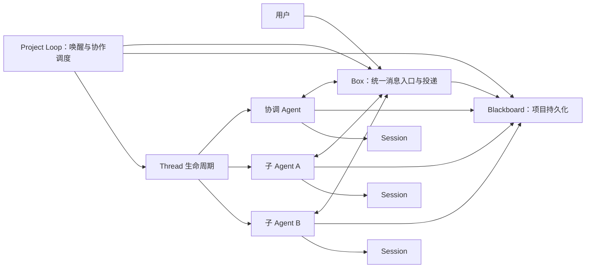

# Project v2：Box、Blackboard 与 Project Loop

> 状态：新设计框架；取代 [原运行时设计](./2026-09-24-project-collaboration-design.md)、[原实施计划](../plans/2026-09-25-project-collaboration-implementation.md)和[过渡期产品对齐稿](./2026-09-25-project-product-realignment.md)。现有 `codex/project-collaboration` 代码属于 v1，不按本稿视为已实现。

日期：2026-09-25。产品形态参照 [新版 Claude Projects 调研](../../research/2026-09-25-claude-projects-redesign.md)，具体边界以本次用户决定为准。

## 产品定义

Project 是可持续使用的容器，创建时只需名称。它可以同时包含仓库、文件与其他资料，既能承接有限目标，也能不断接收新工作。默认界面是用户与协调 Agent 的主对话。协调 Agent 可直接回答简单问题，自行创建或复用 Thread，并在主对话中主动汇报进度与结果。用户可随时发送新消息，不必等 Agent 回复；协调 Agent 立即接收，再决定要影响哪些正在运行的 Thread。

Thread 是 Project 中可独立运行和被用户直接干预的 Agent。用户从主对话卡片或 Overview 打开它，查看自己的 Session、线程内步骤和产物。步骤清单只属于这个 Thread。协调 Agent 可在已交代的目标内连续分派后续工作；超出目标的工作先建议给用户。每个 Thread 的结果可写入 Project，项目记忆由 Agent 自行整理，用户可以查看、修改和纠正。发邮件等对外动作需要用户授权；在 Project 指定仓库与目标分支内，代码合并可由 Agent 完成，冲突与失败要可见。

Project 内没有写死的 search / coding / reviewer Agent 类型。协调 Agent 为具体工作选择模型、工具与资源，创建合适的子 Agent；配置要通过宿主的能力目录和权限约束验证。

## 核心关系



Project Loop 与现有 Agent Loop 是两层循环。Project Loop 决定谁收到消息、何时唤醒、如何创建子 Agent、何时把结果交回父 Agent，以及何时继续已交代的工作。它不替代单个 Agent 的模型请求和工具执行；每个 Agent 仍由 Agent Loop 驱动，每个 Agent 恰有自己的 Session。Project Loop 是一个插件，装在 Project Context，不能在同一 Agent scope 覆盖 `agentLoop` 服务。

一个 Agent 对应一个稳定 ID 和一个文件夹，里面保存身份、可恢复的配置以及唯一的 Session。根 Agent 承担主对话；Overview 中的执行 Thread 是它的后代。父子关系是 Blackboard 中的持久事实，同一个 Project 可以有多层 Agent。Agent 运行中和空闲时身份不变。旧设计的 `Thread → Execution → Session` 层级删除：Thread 在此就是可继续交互的 Agent 身份，Agent Run 是它在某段输入上的执行。需要彻底重启上下文或更换不可兼容配置时，创建有来源链接的新 Thread，而非在一个 Thread 下套另一个 Session。

```text
.tnega/projects/<projectId>/
  blackboard/                 # 共享事实与 Box 信封
  agents/<agentId>/
    agent.json                # 身份与可恢复配置
    session.jsonl             # 唯一的模型历史
  artifacts/                  # 大文件内容；索引在 Blackboard
```

各 Agent 的 inbox 是 Box 对 Blackboard 消息的按收件人视图，不要求复制成第二份 `inbox.jsonl`。代码 Thread 的隔离工作目录与 Agent 身份文件夹分开；一个 Thread 可持有自己的分支和工作树，兄弟 Thread 不直接修改同一工作树。

## 三份事实，各有所有者

| 事实 | 唯一来源 | 说明 |
| --- | --- | --- |
| 某个 Agent 的模型可见历史、工具调用与结果 | 该 Agent 的 Session | 延续 `@tnega/session` 不变量；Blackboard 不复制完整对话。 |
| 项目共享记忆、资料索引、产物引用、Agent 关系、可恢复的 Thread 状态和消息信封 | Blackboard | 是 Project 的共享持久化层；取代旧 Project Log 和 Project 范围的独立 Memory 文件。 |
| 消息应交给谁、是否已送达及其唤醒策略 | Box 的规则，状态持久化在 Blackboard | Box 不另造第二套持久化真源。 |
| 哪些 Agent 当前占用模型或工具 | Project Loop 的运行态 | 可从 Blackboard 与 Session 恢复；进程内 handle 不是持久事实。 |

Blackboard 提供有类型的版本记录及条件提交，不暴露任意键值写入。共享记忆可自动写入，但每条记忆保留作者、来源消息或产物、版本和修改时间；用户编辑也产生新版本。大文件由独立 Artifact Store 保存，Blackboard 只存哈希与引用。读者按需取得相关资料，不把全部项目历史或所有文件塞给每个 Agent。已有 `@tnega/memory` 的全局用户偏好继续保留；普通非 Project Session 的 Workspace Memory 也不受影响。Project Agent 的项目范围记忆只通过 Blackboard 读写，不能同时维护另一份 `.tnega/MEMORY.md` 作为项目真源。

## Box：所有参与者共用一种消息信封

用户输入、协调 Agent 对用户的回复、父子 Agent 通信和用户对 Thread 的直接留言，都经过 Box。用户也是 Box 的一个收件地址；主对话是用户已发送消息与其 inbox 的投影，没有独立的消息捷径。信封至少带 `messageId`、`projectId`、可信 `sender`、收件目标、显示位置（主对话或指定 Thread）、消息类型、内容或引用、`causationId`、创建时间与每位收件人的投递状态。`causationId` 把“用户要求 → 创建 Thread → 子 Agent 回报 → 协调 Agent 简报”串起来，也供主对话在原消息位置放 Thread 卡片。发送者身份由宿主或 Agent scope 绑定，模型不能在参数里伪造用户身份。

Box 的接口应保持窄：`send`、`receive/ack`、`watch`。它把信封和待投递记录一次写入 Blackboard，再通知收件 Agent。Project Loop 只按投递状态唤醒 Agent；普通进度不必每条都唤醒协调 Agent。同一收件人的消息保持有序，不同 Agent 可以并行处理。投递是至少一次；收件 Session 以 `messageId` 去重，准入并冲刷后才向 Box 确认。重启时 Box 重投未确认消息，已写入 Session 的消息不会再次进入模型上下文。对用户收件地址，Web 读取 Box 消息，无需 Agent Session。

Agent 生成的对外消息也不能只停在 Session 中：面向用户的普通 assistant 消息在落入 Session 后自动发布到 Box；Agent 若需在一轮执行中主动发进度，可调用 Box 发送工具。两者都以来源 Session 事件或工具调用生成稳定的 Box id，Project Loop 可在崩溃后补投。收件 Session 的 `user/message` 或 inbox 准入事件记录原 sender 和 Box id；模型可见文本仍由 Session 重建。Box 负责传输，Session 负责该 Agent 实际看见的内容。

### 路由规则

- 用户在主对话发言：送协调 Agent 的 inbox；用户可以在多个 Thread 工作时继续发言。若协调 Agent 已运行，新消息在下个安全 step 边界进入；UI 立即显示消息已接收，不以模型回复作为发送成功条件。
- 协调 Agent 发给用户：进入主对话时间线。发送分派消息时附 Thread id，UI 就地显示卡片并随状态更新。
- 父 Agent 发给子 Agent：目标、改向、输入资料引用或答复进入子 Agent inbox。子 Agent 的报告、完成或阻塞进入直接父 Agent inbox。父 Agent 无需轮询完整子 Session。
- 用户直接给某个 Thread 留言：进入该 Thread inbox；该 Thread 对用户的回复显示在它自己的面板。协调 Agent 另收一条可追溯的活动通知，不把用户消息重新伪装成自己的指令。
- 兄弟 Agent 默认不互发控制消息。共享结果先写 Blackboard，再由共同父 Agent 根据需要转发引用或启动下游 Thread。确有直接协作需求时，必须由父 Agent 显式建立可审计的通信关系，不能任意广播整个项目。

主对话允许这样的时间线：`用户要求 A → 协调 Agent 开 Thread 1 → 用户补充 B → 协调 Agent 改向 Thread 1、再开 Thread 2 → Thread 1 回报 → 协调 Agent 主动简报 → Thread 2 回报 → 协调 Agent 再简报`。用户和协调 Agent 消息无须轮换；Box 的顺序与因果引用决定呈现位置，Project Loop 不等待一次“问答轮次”结束才处理下一封消息。

## Blackboard：共享知识与产物

Blackboard 保存四类项目事实：项目设置与资料目录、Agent 树和稳定工作状态、共享记忆与决定、产物目录及引用。完整对话由各 Agent 的 Session 保存。所有写入附版本和来源，支持并发条件更新；冲突由写入者重新读取后处理，不能最后写入覆盖。子 Agent 可以在授权范围内写资料、产物和记忆，协调 Agent 负责整理相互冲突的结论。用户可随时查看、编辑、删除或恢复记忆版本；编辑立即成为后续 Agent 读取的版本，运行中的 Agent 在下一安全边界收到变更通知。

每次 Agent Run 记录其实际读取的 Blackboard 版本和资料引用。这样以后修改记忆，也不会改变过去一次模型请求的含义。Library 是 Blackboard 的资料/产物索引视图；它不是另一个状态存储。普通工作可以用自然语言结束；只有需要证据或用户明确要求验收时才启用 Eval / Review，不把旧版强制 `submit → review` 状态机带过来。

## 父子 Agent 如何协作

1. 父 Agent 判断一项工作值得独立执行，调用 `spawn_thread`。输入是工作目标、相关 Blackboard 引用、期望回报、工具能力要求和可用预算；不传父 Session 的完整历史。Project Loop 校验能力、权限、并发和父子深度，创建 Agent 文件夹与 Session，在 Blackboard 登记关系，最后用 Box 投递首封工作消息。整个操作以稳定请求 ID 去重，崩溃后可补齐未完成阶段。
2. 子 Agent 使用自己的模型与工具运行，可把步骤进度留在自身 Thread，也可通过 Box 发关键进展给父 Agent。需要其他 Agent 帮忙时，它可在被授权的深度与预算内再创建子 Thread；协作关系仍是一棵可追溯的 Agent 树。
3. 子 Agent 可读取所需 Blackboard 内容，写回发现与产物。需要父 Agent 决定时发 `request` 并进入等待；父 Agent 回复通过 Box 返回。等待不占用模型调用。
4. 子 Agent 发 `complete`、`blocked` 或 `failed` 消息时，Project Loop 更新 Blackboard 状态并通知父 Agent。父 Agent 依据结果继续分派、在主对话主动简报，或向用户提出超范围建议。自然语言结果可包含产物引用，不强制每项工作走正式审阅。
5. 用户可以打开任意 Thread 直接留言、中止或纠偏。Thread 详情显示其 Session 与步骤清单；主对话只由协调 Agent 发言，子 Agent 的详细输出留在自身 Thread。

线程间的依赖记录在 Blackboard，避免只靠父子树表达“B 要用 A 的结果”。父子树决定谁可以下指令与接收回报，依赖关系决定何时可以继续工作；二者分开。父 Agent 不应同步等待子 Agent 结束，Project Loop 由 Box 通知再次唤醒它。

## 模型、工具与权限

创建 Thread 时，父 Agent 从宿主提供的模型路由、工具 bundle 和资源目录中组合一份 Agent 配置。配置是数据，不能让模型写可执行插件路径或任意 MCP 地址。每个 Agent scope 安装自己的 ToolsService、模型和相关 Provider；父 Agent 只有 Box、Blackboard、Thread 管理与向用户发言所需工具，子 Agent 可按任务获得搜索、代码、文档或外部服务工具。是否能委派某能力依据 Project 授权与能力目录，不能因为父 Agent 自己没有该工具就失去委派权。

Project 授权是所有子 Agent 的上限；继续向下委派只能收窄。内部仓库可在指定范围内自动合并到对应目标分支，冲突或必要检查失败会阻止继续集成并报告。发邮件、发布内容等对外动作通过独立授权请求进入用户 inbox，收到明确许可后才能执行。未经用户许可，Agent 不能把“建议发布”当成已授权动作。

代码协作由父 Agent 挑选待集成的子 Thread 结果，Project Loop 核对来源分支、目标分支和当前提交，再执行合并。成功与冲突都写入 Blackboard，并通过 Box 通知有关 Agent；不能靠子 Agent 在共享目录里互相覆盖来完成协作。

## 插件与包的目标组织

| 包 | 角色 |
| --- | --- |
| `packages/loop/agent-loop` | 从现有 `@tnega/agent` 中整理默认单 Agent Loop；保持现有公开入口兼容。 |
| `packages/loop/project-loop` | Project 级 Loop 插件：Box 消费、唤醒、子 Agent 调度、父子回报、恢复。 |
| `packages/project/project` | Project 身份、公共词汇与 Project scope 插件，不再承载巨型命令联合与状态归约。 |
| `packages/project/blackboard` 与 `blackboard-local` | 共享持久化的 Service Definition 与本地 Provider，包含版本化事实和信封存储。 |
| `packages/project/box` 与 `box-blackboard` | 消息通道的 Service Definition 与基于 Blackboard 的投递 Provider。 |
| `packages/project/thread` 与 `thread-local` | Thread 生命周期的 Service Definition 与本地 Provider，管理 Agent 文件夹、Session 和父子关系；复用现有 AgentRegistry。 |
| `packages/project/artifact-store` 与 `artifact-local` | 内容存储的 Service Definition 与本地 Provider；Blackboard 只记引用。 |
| `packages/project/tool-box`、`tool-blackboard`、`tool-thread` | 三组独立的模型可见 Consumer，只依赖各自能力定义，由组合层按 Agent 权限安装。 |
| `packages/cli` 与 `apps/web` | 选择本地 Provider、装配 Project Context；Web 投影 Box、Blackboard 与 Session。 |

这些包各自可以被挂载和替换，Provider 与 Consumer 依赖 Definition，遵守 [能力缝约定](../../adr/0006-capability-seams.md)。Project Host 只负责组合，不另造协作业务状态。已有 `@tnega/subagent` 的文件夹、Session 与 inbox 机制是迁移起点；Project Thread 要支持用户直接介入、异构模型工具和持续接收消息，不能原封不动套用当前仅相邻通信、统一模型和有界任务的 Provider。普通 Subagent 能力保持兼容，底层 Agent 身份与投递机制逐步共用。

## Web 重设计

首页只要求 Project 名称即可创建。进入后中央是持续主对话，支持发送时其他 Agent 仍在运行；协调 Agent 的多条主动消息按时间排列，Thread 卡片嵌在触发它的消息下。顶部 Overview 可按需打开，突出等待用户的 Thread；侧边 Thread 面板显示该 Agent 的 Session、步骤、消息输入和产物。Library 展示共享资料和产物，Memory 可查看、编辑并追溯来源。设置、权限和预算放次级入口。

UI 不从模型文本猜 Thread 是否存在、何时完成或产物在哪：卡片读 Blackboard 的关系和状态，消息读 Box，详细执行记录读各 Agent Session。主对话与 Thread 面板同时打开时分别订阅，断线后按游标补齐；用户的发送结果先以 Box 的持久接收回执确认。旧 `ProjectOverview`、`ProjectChat`、固定角色创建表单和强制审阅页面按新信息架构重做，不能通过改标题或 CSS 视为完成。

## 旧实现迁移与验证重点

保留 Core Fiber、单 Agent Loop、Session、DurableInbox 的恢复语义和分作用域模型/工具装配；审查并复用旧版的权限、隔离执行与内容寻址产物机制。替换旧 `Project Log + Execution + 固定 WorkerProfile + 强制验收` 协议、`project-runtime` 调度和现有 Project Web 页面。旧项目日志不能按新事件含义直接重放。新格式使用独立版本和目录；旧数据先只读或导出，只有建立明确字段映射后才提供迁移，不做隐式转换。

设计落地时必须验证：用户连续发两条消息而协调 Agent 尚未回复；父子同时发送且消息不丢、不重复进入模型；创建子 Agent 后崩溃并恢复；子 Agent 完成后父 Agent 自动继续；用户直接改向正在运行的 Thread；Blackboard 记忆并发更新与用户纠错；外部授权与内部自动合并的边界；重新打开页面后主对话卡片与 Thread 详情一致。这里列的是设计验收场景，具体测试随实现切分。
