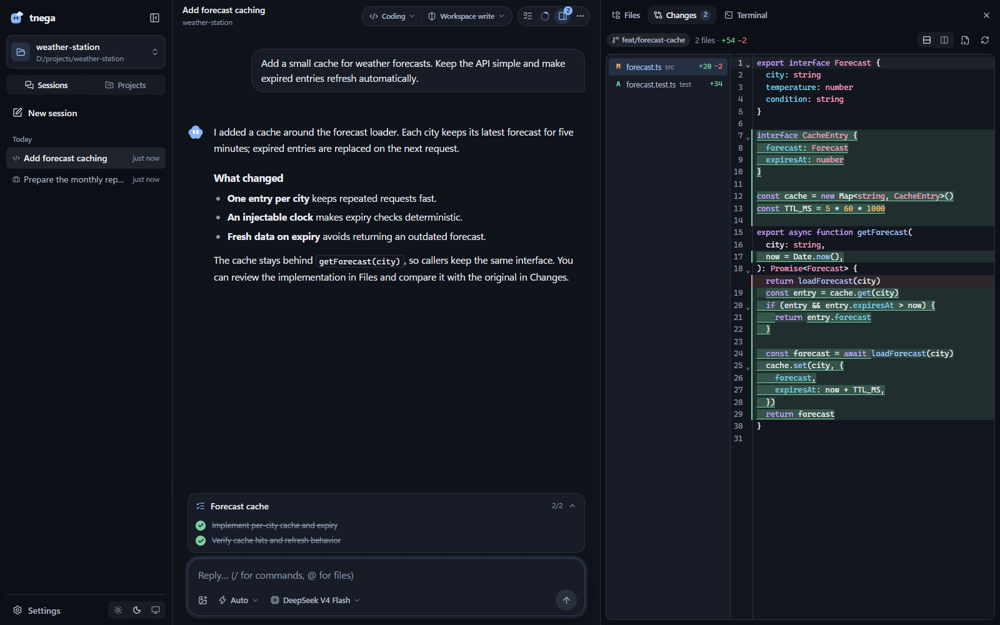

# Tnega

[English](../README.md) · [更新记录](../CHANGELOG.md) · [下载](https://github.com/whale4rain/tnega/releases) · [发布指南](publish/README.md)

Tnega 是一个本地 Agent 工作空间，也是可组合的 Agent Harness。你可以在同一个界面中对话、编写代码、处理 Office 文档、查看改动、使用终端和浏览器。持续项目由协调者与并行 Thread 协作完成，共享记忆和产物。Tnega 是 agent 的倒写。

## 项目截图




截图来自当前 Web 界面，使用隔离的演示数据。

## 已具备的功能

| 场景 | 能力 |
| --- | --- |
| 编码 | Coding Agent，Auto / Plan / Goal 模式，文件读写、ripgrep 搜索、技能、MCP、斜杠命令与 `@` 文件引用。 |
| 文档工作 | Work Agent 创建、读取和原地编辑 DOCX / XLSX / PPTX，支持主题、表格与原生图表；生成文件显示为可预览、缩放和下载的卡片。 |
| 持续项目 | 协调者派发并行 Thread，查看进度、直接留言，使用共享 Memory、Library 和项目指令。 |
| 工作台 | Files 文件树与代码编辑器（Ctrl+S 保存，检测磁盘并发改动）；Changes 统一或并排 Git diff；多个 PTY Terminal；Browser；可关闭的文档和子代理记录标签。 |
| 浏览器 | Agent 打开网页、按元素引用点击和输入、截图、读取控制台与网络；应用内显示多标签浏览器，元素选择器将页面元素带入消息。桌面使用原生视图，Web 使用实时画面。 |
| 后台任务 | 长时间命令、开发服务器与委派任务显示进度并可停止；阻塞或非阻塞问题让 Agent 获取用户决定。后台 Job 不会在进程重启后恢复。 |

**会话与记忆**：General、Coding、Work 的 Session 以 JSONL 事件持久化，可分支、编辑重发、压缩上下文，查看 token、缓存与速度。完成的 Agent Run 展示最终回复，过程可展开。支持粘贴、拖放和附加图片；文本模型获得回退说明。用户记忆在 `~/.tnega/MEMORY.md`，工作区记忆在 `.tnega/MEMORY.md`。

**模型与扩展**：Settings 配置多个 OpenAI 兼容或 Anthropic Messages 模型路由，每个 Session 选择模型与思考强度。外部插件通过 profile 文件加载，在 Web / 桌面宿主中热更新。可选 CodeMode 使用 QuickJS 执行 JavaScript，组合已有工具并保留各工具的权限检查。

**权限与沙箱**：read-only、workspace-write、bypass 是权限预设；Ask me / Auto review 是独立审批设置，无法自动决定时交给用户。Linux、macOS 和 Windows 的本机沙箱限制文件写入，机制不可用时拒绝受限执行；bypass 明确关闭沙箱。见[审批说明](../packages/auto-approval/README.md)与[沙箱 ADR](adr/0008-sandbox-seam.md)。

**界面**：浅色、深色与跟随系统主题，天气符号表达 Agent 状态。`Ctrl+J` 开关工作台，`` Ctrl+` `` 打开终端。桌面端关闭窗口后继续在托盘运行，点击托盘可恢复，Exit Tnega 退出应用与本地运行时。

## 安装与更新

### Windows 桌面端

从 [GitHub Releases](https://github.com/whale4rain/tnega/releases/latest) 下载 `Tnega-Setup-<版本>.exe`，安装后在 Settings 配置模型和 API Key。

**0.4.6 起支持应用内更新**：启动时及每四小时检查新版本，后台下载后在 Settings 旁显示 **Update**，点击安装并重启。也可在 **Settings → Check for updates** 手动检查。用户升级后续版本无需自行打包或反复下载安装包；旧版只需手动安装一次支持更新的版本。维护者仍需为每个新版本构建并发布安装包与更新源，见[发布指南](publish/README.md)。

### CLI 与本地 Web

需要 Node.js **≥22.19.0**。

```bash
npm install -g tnega
# 或 pnpm add -g tnega
tnega web
# 浏览器打开 http://127.0.0.1:3080，在 Settings 配置模型。
```

无界面的单次执行：

```bash
export TNEGA_API_KEY=your-api-key
tnega run "回复：hello"
```

PowerShell 使用 `$env:TNEGA_API_KEY = 'your-api-key'`。默认路由为 OpenCode Go 的 `deepseek-v4-flash`（OpenAI 兼容端点），也支持 `minimax-m3`（Anthropic Messages）；可配置自己的路由。Windows 配置在 `%USERPROFILE%\.tnega\config.json`，Linux/macOS 在 `~/.config/tnega/config.json`。环境变量、参数和多模型配置见 [CLI README](../packages/cli/README.md)。

CLI 更新使用 `npm install -g tnega@latest`。桌面自动更新只适用于打包后的应用。当前 Session 格式为 v10，不兼容的旧格式会被拒绝，不会原地迁移。

## 开发与文档

```bash
pnpm install
pnpm tnega web --port 3080
pnpm --filter @tnega/web dev
```

按改动范围运行 `pnpm test`、`pnpm typecheck`、`pnpm lint`、`pnpm build`。核心插件随 Fiber 管理作用域与销毁；Service Definition、Provider、Consumer 的依赖方向见 [ADR 0006](adr/0006-capability-seams.md)。npm 包同时提供根入口和按域拆分的 TypeScript 库导出。

- [领域术语](../CONTEXT.md)与[开发指南](../AGENTS.md)
- [Project 指南](project/README.md)
- [核心](../packages/core/README.md)、[Agent](../packages/agent/README.md)、[CLI/runtime](../packages/cli/README.md)
- [Web](../apps/web/README.md)、[桌面端](../apps/desktop/README.md)、[视觉设计](design/tnega-design.md)
- [更新记录](../CHANGELOG.md)、[版本说明](releases/)、[发布流程](publish/README.md)

旧 eval、evolve 与 benchmark 包已在 0.4.6 移除，取舍见 [ADR 0011](adr/0011-remove-eval-first.md)。

## License

[MIT](../LICENSE)
